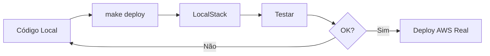

# 🎉 LocalStack Setup - Resumo

## ✨ O que foi implementado?

O projeto agora suporta **desenvolvimento local completo** usando LocalStack ao invés de uma conta AWS real!

## 📁 Arquivos Adicionados

```
serverless-webapp-starter-kit/
├── 📘 README-LOCALSTACK.md              # Documentação completa
├── 🚀 QUICK-START-LOCALSTACK.md         # Guia rápido
├── 📋 CHANGELOG-LOCALSTACK.md           # Log de mudanças
├── 📊 Makefile                          # Comandos automatizados
├── 🔧 localstack-init.sh                # Script de inicialização
├── ⚙️  localstack.env.example           # Template de variáveis
├── 🔨 awslocal.sh                       # AWS CLI wrapper
├── 🐳 docker-compose.override.yml.example # Customizações Docker
└── 📝 .gitignore                        # Arquivos ignorados
```

## 🔄 Arquivos Modificados

### compose.yaml
```yaml
✅ Adicionado: LocalStack service
✅ Adicionado: Network configuration
✅ Configurado: Persistência de dados
```

### cdk/package.json
```json
✅ Nova dependência: aws-cdk-local
✅ Novo script: deploy:local
✅ Novo script: destroy:local
```

### cdk/bin/cdk.ts
```typescript
✅ Detecção automática de modo LocalStack
✅ Configuração de account ID (000000000000)
✅ Desabilita domínios em modo local
```

### README.md
```markdown
✅ Seção sobre LocalStack
✅ Link para documentação completa
```

## 🎯 Como Usar (3 comandos!)

```bash
make setup    # 1. Instala tudo
make init     # 2. Inicia ambiente
make deploy   # 3. Deploy local!
```

## 🛠️ Comandos Principais

| Comando | Descrição |
|---------|-----------|
| `make help` | Ver todos os comandos |
| `make start` | Iniciar LocalStack |
| `make stop` | Parar serviços |
| `make status` | Ver status |
| `make logs` | Ver logs |
| `make deploy` | Deploy no LocalStack |
| `make destroy` | Remover recursos |
| `make clean` | Limpar tudo |

## 🌟 Benefícios

### ✅ Antes vs Depois

| Antes | Depois |
|-------|--------|
| ❌ Requer conta AWS | ✅ 100% Local |
| ❌ Custos por uso | ✅ Grátis |
| ❌ Internet necessária | ✅ Funciona offline |
| ❌ Deploy ~20 minutos | ✅ Deploy ~5 minutos |
| ❌ Limpeza manual | ✅ `make clean` |

### 💰 Economia

- **$0** custo de desenvolvimento
- **$0** custo de testes
- **$0** custo de experimentação

### ⚡ Velocidade

- **5x mais rápido** para testar mudanças
- **Sem espera** de propagação DNS
- **Sem delay** de CloudFormation

### 🔒 Segurança

- **Sem credenciais** AWS necessárias
- **Sem risco** de custos inesperados
- **Sem preocupação** com limites de serviço

## 🎨 Fluxo de Trabalho Recomendado



## 📊 Serviços Suportados

### ✅ Totalmente Funcional
- S3, Lambda, CloudFormation
- IAM, Secrets Manager, SSM
- EventBridge, CloudWatch Logs

### ⚠️ Parcialmente Funcional
- Cognito (básico)
- AppSync (limitado)
- CloudFront (limitado)

### ❌ Não Suportado
- Route53, ACM
- Lambda@Edge (streaming)

## 🚀 Exemplo de Uso

```bash
# Terminal 1: Iniciar ambiente
$ make init
🚀 Iniciando serviços...
✅ LocalStack está pronto!
✅ PostgreSQL está pronto!

# Terminal 2: Deploy
$ make deploy
🚀 Fazendo deploy no LocalStack...
✅ Deploy concluído!

# Terminal 3: Ver logs
$ make logs
[Logs em tempo real...]

# Quando terminar
$ make clean
🧹 Limpando ambiente...
✅ Ambiente limpo!
```

## 📚 Documentação

| Documento | Propósito |
|-----------|-----------|
| [README-LOCALSTACK.md](README-LOCALSTACK.md) | Guia completo |
| [QUICK-START-LOCALSTACK.md](QUICK-START-LOCALSTACK.md) | Início rápido |
| [CHANGELOG-LOCALSTACK.md](CHANGELOG-LOCALSTACK.md) | Mudanças detalhadas |

## 🐛 Troubleshooting Rápido

### Problema: LocalStack não inicia
```bash
make clean && make start
```

### Problema: Deploy falha
```bash
cd cdk && rm -rf cdk.out/ && cd .. && make deploy
```

### Problema: Porta em uso
```bash
# Verificar o que está usando a porta
sudo lsof -i :4566
```

### Problema: Sem espaço
```bash
# Limpar Docker
docker system prune -a --volumes
```

## 🎯 Próximos Passos

1. ✅ **Setup Completo** - Ambiente LocalStack configurado
2. 📝 **Teste o ambiente** - Execute `make init && make deploy`
3. 🔍 **Explore** - Use os comandos make para interagir
4. 🚀 **Desenvolva** - Faça suas mudanças localmente
5. ☁️ **Deploy Real** - Quando pronto, deploy na AWS

## 💡 Dicas Pro

### Alias Úteis
```bash
# Adicione ao seu .bashrc ou .zshrc
alias mstart='make start'
alias mdeploy='make deploy'
alias mclean='make clean'
alias mlogs='make logs'
```

### Variáveis de Ambiente Persistentes
```bash
# Crie localstack.env a partir do exemplo
cp localstack.env.example localstack.env

# Carregue automaticamente (adicione ao .bashrc/.zshrc)
source ~/path/to/project/localstack.env
```

### Docker Compose Personalizado
```bash
# Copie o exemplo e customize
cp docker-compose.override.yml.example docker-compose.override.yml
# Edite docker-compose.override.yml conforme necessário
```

## 🤝 Contribuindo

Encontrou um problema? Tem uma sugestão?

1. 📝 Abra uma issue descrevendo o problema/sugestão
2. 🔧 Ou faça um PR com a correção/melhoria
3. 📚 Ou melhore a documentação

## 🎊 Resultado Final

Agora você pode:

✅ Desenvolver 100% localmente
✅ Testar sem custos
✅ Iterar rapidamente
✅ Aprender AWS sem risco
✅ Trabalhar offline

**Tudo isso mantendo a mesma arquitetura da AWS real!**

---

## 📞 Suporte

- 📖 Documentação: [README-LOCALSTACK.md](README-LOCALSTACK.md)
- 🔥 Quick Start: [QUICK-START-LOCALSTACK.md](QUICK-START-LOCALSTACK.md)
- 📋 Mudanças: [CHANGELOG-LOCALSTACK.md](CHANGELOG-LOCALSTACK.md)
- 🌐 LocalStack Docs: https://docs.localstack.cloud/

---

**🎉 Ambiente LocalStack pronto para uso! Happy coding! 🚀**
