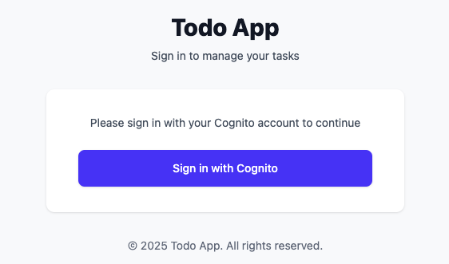
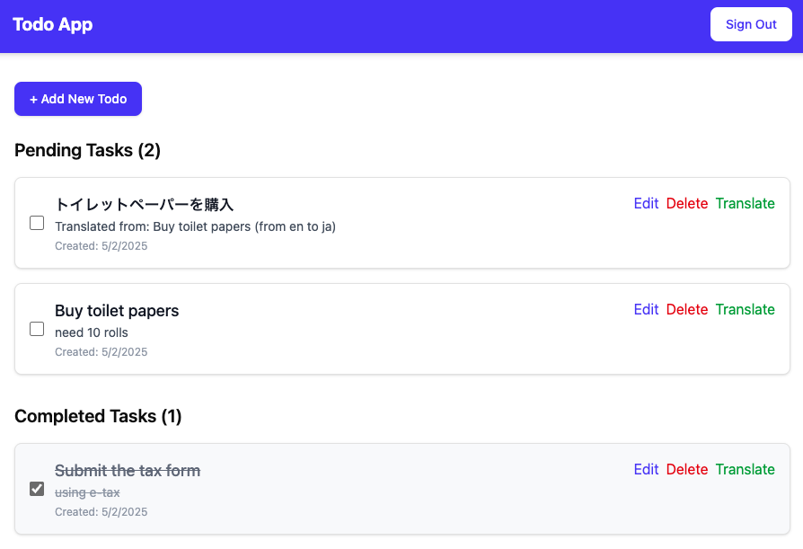

# Etapa 3: Deploy da Aplicação Web

[← Voltar](README.md) | [← Anterior: Infraestrutura](02-infrastructure.md) | [Próximo: Features Avançadas →](04-advanced-features.md)

---

## ⏱️ Tempo Estimado: 25 minutos

Nesta etapa, você vai deployar a aplicação web completa com todos os componentes.

---

## 3.1 Habilitar Todos os Recursos

### Descomentar no main-stack.ts

Abra `cdk/lib/main-stack.ts` e **descomente** as seções restantes:

```typescript
// Descomentar todas estas linhas:

const asyncJob = new AsyncJob(this, 'AsyncJob', { database: database, eventBus });

const webapp = new Webapp(this, 'Webapp', {
  database,
  hostedZone,
  certificate: props.sharedCertificate,
  signPayloadHandler: props.signPayloadHandler,
  accessLogBucket,
  auth,
  eventBus,
  asyncJob,
  subDomain: 'web',
});

new CfnOutput(this, 'FrontendDomainName', {
  value: webapp.baseUrl,
});
```

---

## 3.2 Deploy Completo

```bash
npx cdk deploy --all
```

Responda `y` para todas as confirmações.

**Tempo estimado:** 12-15 minutos

> 💡 **Por que demora?**
>
> O CDK está:
> - Fazendo build da aplicação Next.js
> - Criando imagens Docker
> - Fazendo upload para ECR (registry)
> - Criando Lambdas
> - Configurando CloudFront
> - Executando migrations do banco

---

## ⏰ Enquanto Aguarda...

Vamos entender o que está sendo criado!

### 🔍 Conceito: AWS Lambda

**O que é?** Serviço de computação serverless - executa código sem gerenciar servidores.

**Características:**
- ⚡ Escala automaticamente
- 💰 Paga apenas por execução
- 🚀 Suporta containers Docker
- 🔧 Timeout: até 15 minutos
- 💾 Memória: 128MB a 10GB

**Nossa configuração:**
```typescript
const handler = new DockerImageFunction(this, 'Handler', {
  code: image.toLambdaDockerImageCode(),
  timeout: Duration.minutes(3),
  memorySize: 512,  // MB
  architecture: Architecture.ARM_64  // Mais barato!
});
```

**Leia mais:** [concepts/lambda.md](concepts/lambda.md)

---

### 🔍 Conceito: CloudFront + Lambda Function URL

**Arquitetura:**
```
Usuário → CloudFront → Lambda@Edge → Lambda Function URL → Next.js Lambda
```

**CloudFront (CDN):**
- Cache global de conteúdo
- 450+ edge locations
- Proteção DDoS
- Certificado SSL grátis

**Lambda@Edge:**
- Executa no edge (perto do usuário)
- Valida requisições
- Assina payloads
- Adiciona headers de segurança

**Lambda Function URL:**
- Endpoint HTTP direto para Lambda
- Suporta response streaming
- Mais rápido que API Gateway

**Leia mais:** [concepts/cloudfront.md](concepts/cloudfront.md)

---

### 🔍 Conceito: Prisma ORM

**O que é?** Object-Relational Mapper - abstração sobre SQL.

**Schema:**
```prisma
model TodoItem {
  id          String @id @default(uuid())
  title       String
  description String @db.Text()
  userId      String
  status      TodoItemStatus
  createdAt   DateTime @default(now())
  updatedAt   DateTime @updatedAt
}
```

**Code Gerado:**
```typescript
// Type-safe queries!
const todos = await prisma.todoItem.findMany({
  where: { userId, status: 'PENDING' },
  orderBy: { createdAt: 'desc' }
});
```

**Migrations:**
```bash
npx prisma migrate dev   # Desenvolvimento
npx prisma migrate deploy # Produção (usado pelo CDK)
```

---

### 🔍 Conceito: Database Migration

**O que é?** Processo de atualizar schema do banco de dados de forma controlada.

**Como funciona neste projeto:**

1. **CDK Deploy**
   ↓
2. **Migration Runner Lambda criado**
   ↓
3. **CDK Trigger invoca Lambda automaticamente**
   ↓
4. **Lambda executa:** `npx prisma migrate deploy`
   ↓
5. **Tabelas criadas no Aurora**
   ↓
6. **Deploy continua**

**Migrations aplicadas:**
- Cria tabela `User`
- Cria tabela `TodoItem`
- Cria índices para performance
- Cria constraints e foreign keys

---

## ✅ Verificar o Deploy

Quando terminar, você verá outputs importantes:

```
✅  ServerlessWebappStarterKitUsEast1Stack
✅  ServerlessWebappStarterKitStack

Outputs:
ServerlessWebappStarterKitStack.FrontendDomainName = https://xxxxx.cloudfront.net
ServerlessWebappStarterKitStack.MigrationFunctionName = ServerlessWebapp...MigrationRunner
ServerlessWebappStarterKitStack.AsyncJobHandlerArn = arn:aws:lambda:...
```

**Guarde a URL do `FrontendDomainName`!**

---

## 3.3 Acessar a Aplicação

### Abrir no Navegador

1. Copie a URL do `FrontendDomainName`
2. Cole em uma nova aba do navegador
3. Aguarde carregar (pode levar 10-20 segundos na primeira vez)

**Primeira tela:** Sign In page



---

## 3.4 Criar uma Conta

### Sign Up

1. Clique em **Sign up** (ou **Create account**)
2. Preencha o formulário:
   - **Email**: Use um email real (vai receber código)
   - **Password**: Mínimo 8 caracteres, com maiúscula, número e símbolo
   - **Exemplo:** `Workshop@2025`

3. Clique em **Sign up**

### Verificar Email

1. Verifique seu email
2. Copie o código de verificação (6 dígitos)
3. Cole no formulário
4. Clique em **Confirm**

> 💡 **Dica:** Se não receber email, verifique spam/lixeira

### Fazer Login

1. Entre com email e senha
2. Você será redirecionado para a aplicação

---

## 3.5 Testar a Aplicação

### Criar um TODO

1. Clique em **+ Add New Todo**
2. Preencha:
   - **Title**: `Aprender AWS CDK`
   - **Description**: `Deploy de aplicação serverless completa`
3. Clique em **Create Todo**

✅ **Sucesso!** O TODO aparece na lista "Pending Tasks"

### Marcar como Completo

1. Clique no **checkbox** ao lado do TODO
2. Ele move para "Completed Tasks" ✅

### Editar TODO

1. Clique no TODO para expandir
2. (Dependendo da UI) Edite title/description
3. Salve

### Deletar TODO

1. Clique no ícone de **lixeira** 🗑️
2. TODO é removido

---

## 🎨 Interface da Aplicação



**Componentes:**
- Header com botão de Sign Out
- Formulário de criação de TODO
- Lista de "Pending Tasks"
- Lista de "Completed Tasks"
- Botões de ação (complete, delete, translate)

---

## 🔍 Como Funciona Internamente?

### Next.js Server Actions

**Frontend** (`CreateTodoForm.tsx`):
```typescript
const { handleSubmitWithAction } = useHookFormAction(
  createTodo,  // Server Action
  zodResolver(createTodoSchema)
);
```

**Backend** (`actions.ts`):
```typescript
export const createTodo = authActionClient
  .schema(createTodoSchema)
  .action(async ({ parsedInput, ctx }) => {
    const { title, description } = parsedInput;
    const { userId } = ctx;  // Da sessão

    const todo = await prisma.todoItem.create({
      data: { title, description, userId, status: 'PENDING' }
    });

    revalidatePath('/');  // Atualiza cache
    return { todo };
  });
```

### Fluxo Completo

```
1. Usuário preenche formulário
          ↓
2. Form submete (client component)
          ↓
3. Server Action executa (Lambda)
          ↓
4. Valida dados (Zod schema)
          ↓
5. Cria record no Prisma
          ↓
6. Prisma INSERT no Aurora
          ↓
7. revalidatePath() atualiza cache
          ↓
8. UI re-renderiza com novo TODO
```

### Type Safety End-to-End

```typescript
// Schema de validação
const createTodoSchema = z.object({
  title: z.string().min(1, "Required"),
  description: z.string()
});

// Prisma types
type TodoItem = {
  id: string;
  title: string;
  description: string;
  status: TodoItemStatus;
  // ...
}

// Tudo é type-safe! ✅
```

---

## 📊 Explorar CloudWatch Logs (Opcional)

### Ver Logs da Aplicação

1. Acesse [CloudWatch Console](https://console.aws.amazon.com/cloudwatch)
2. Vá em **Logs** → **Log groups**
3. Encontre `/aws/lambda/ServerlessWebappStarterKitStack-WebappHandler...`
4. Veja streams de logs
5. Explore requisições e respostas

**O que você verá:**
- Requisições HTTP
- Queries do Prisma
- Erros (se houver)
- Performance metrics

---

## 📊 Resumo da Etapa

### O Que Foi Criado

**AsyncJob Lambda:**
- ✅ Handler para jobs assíncronos
- ✅ Conectado ao Aurora
- ✅ Conectado ao EventBus
- ✅ Permissões para Translate/Comprehend

**Webapp:**
- ✅ Next.js Lambda (512MB, ARM64)
- ✅ CloudFront Distribution
- ✅ Lambda@Edge function
- ✅ Function URL
- ✅ VPC configuration
- ✅ Environment variables

**Migration:**
- ✅ Migration Runner Lambda
- ✅ CDK Trigger (auto-execução)
- ✅ Database schema criado
- ✅ Tabelas `User` e `TodoItem`

### Recursos Totais

**~50 recursos CloudFormation** agora deployados!

---

## 🎉 Próxima Etapa

Parabéns! Sua aplicação está rodando na AWS!

**Agora vamos testar recursos avançados: tradução e real-time!**

👉 **[Etapa 4: Features Avançadas →](04-advanced-features.md)**

---

[← Voltar](README.md) | [← Anterior: Infraestrutura](02-infrastructure.md) | [Próximo: Features Avançadas →](04-advanced-features.md)

**Tempo desta etapa:** 25 minutos ⏱️
