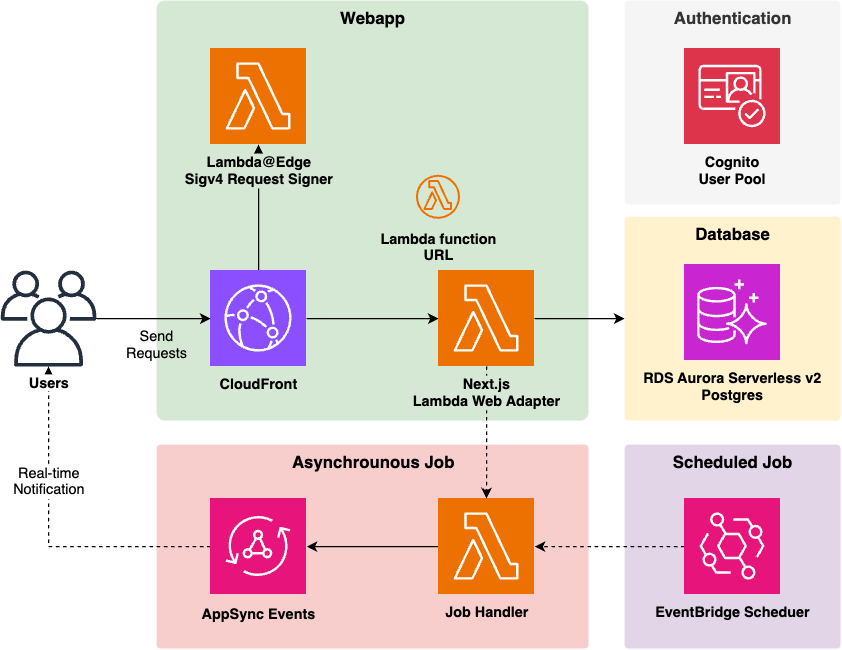

# Workshop: Aplicação Web Serverless Full-Stack na AWS

## 🎯 Bem-vindo!

Este é um workshop prático de **90 minutos** onde você aprenderá a implantar uma aplicação web serverless completa na AWS usando Infrastructure as Code (IaC) com AWS CDK.

**Tudo será feito via código - sem usar o Console da AWS para criar recursos!**

---

## 📚 Estrutura do Workshop

O workshop está dividido em 5 etapas incrementais:

### [📖 Introdução](00-introduction.md)
Visão geral, objetivos e arquitetura do que você vai construir.

### [🚀 Etapa 1: Configuração Inicial (15 min)](01-setup.md)
- Acessar GitHub Codespaces
- Configurar credenciais AWS
- Explorar estrutura do projeto
- Entender conceitos básicos de CDK

### [🏗️ Etapa 2: Infraestrutura Base (25 min)](02-infrastructure.md)
- **Fase 2A**: Deploy de VPC + Aurora Database
- **Fase 2B**: Adicionar Cognito Auth + EventBus
- Conceitos: VPC, NAT, Aurora Serverless, Cognito

### [🌐 Etapa 3: Aplicação Web (25 min)](03-application.md)
- Deploy completo da aplicação Next.js
- Teste de autenticação
- Criar e gerenciar TODOs
- Conceitos: Lambda, CloudFront, Prisma, Migrations

### [⚡ Etapa 4: Recursos Avançados (15 min)](04-advanced-features.md)
- Jobs assíncronos com Amazon Translate
- Notificações em tempo real
- WebSockets com AppSync Events

### [🧹 Etapa 5: Exploração e Limpeza (10 min)](05-cleanup.md)
- Navegação no AWS Console
- **IMPORTANTE**: Destruir recursos

---

## 📋 Recursos Adicionais

### Guias e Referências
- 📄 [Referência Rápida](quick-reference.md) - Comandos essenciais

---

## ⏱️ Cronograma Rápido

| Etapa | Tempo | Conteúdo |
|-------|-------|----------|
| 0 | 5 min | [Introdução](00-introduction.md) |
| 1 | 15 min | [Setup](01-setup.md) |
| 2 | 25 min | [Infraestrutura](02-infrastructure.md) |
| 3 | 25 min | [Aplicação](03-application.md) |
| 4 | 15 min | [Features Avançadas](04-advanced-features.md) |
| 5 | 10 min | [Cleanup](05-cleanup.md) |
| **Total** | **90 min** | |

---

## 🎓 O Que Você Vai Aprender

✅ Infrastructure as Code com AWS CDK
✅ Deploy de aplicações serverless
✅ Arquitetura full-stack moderna
✅ Autenticação com Amazon Cognito
✅ Banco de dados serverless (Aurora)
✅ Real-time com WebSockets
✅ Jobs assíncronos com Lambda

---

## 🚦 Como Começar

1. **Primeira vez?** Comece pela [Introdução](00-introduction.md)
2. **Já conhece o projeto?** Vá direto para [Etapa 1: Setup](01-setup.md)
3. **Referência rápida?** Use [Quick Reference](quick-reference.md)

---

## 📦 O Que Você Vai Construir

Uma aplicação completa de **Lista de Tarefas (TODO)** com:

- ✅ Frontend Next.js responsivo
- ✅ Backend serverless (Lambda)
- ✅ Banco de dados PostgreSQL serverless
- ✅ Autenticação segura (Cognito)
- ✅ Tradução automática (Amazon Translate)
- ✅ Notificações em tempo real (WebSockets)
- ✅ CDN global (CloudFront)

---

## 🎯 Pré-requisitos

### Conhecimento
- ✅ JavaScript/TypeScript básico
- ✅ Familiaridade com linha de comando
- ✅ Conceitos básicos de web development

### Ferramentas (Já incluídas no Codespaces)
- ✅ Node.js 22
- ✅ AWS CLI
- ✅ Docker
- ✅ VS Code

### Fornecido pelo Professor
- ✅ Credenciais AWS
- ✅ Acesso ao repositório GitHub

---

## 💡 Dicas para Aproveitar ao Máximo

1. 📖 **Leia antes de fazer** - Entenda o que vai acontecer
2. ⚡ **Mantenha referência aberta** - Use [Quick Reference](quick-reference.md)
3. 🤔 **Pergunte** - Não hesite em pedir ajuda
4. 🔍 **Explore** - Veja recursos no AWS Console
5. 🧹 **Lembre do cleanup** - Destrua recursos no final!

---

## 📞 Suporte

- 👨‍🏫 **Durante workshop**: Pergunte ao instrutor
- 📄 **Comandos**: [Quick Reference](quick-reference.md)
- 📧 **Após workshop**: Issues do GitHub

---

## 🎉 Pronto para Começar?

👉 **[Vamos lá! Clique aqui para começar →](00-introduction.md)**

---

**Última atualização:** Outubro 2025
**Duração:** 90 minutos
**Nível:** Iniciante a Intermediário
